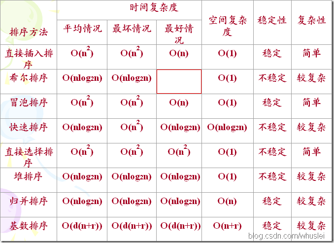

# 数据结构和算法

该文章来自[我](https://www.github.com/lisongting) 的[https://github.com/lisongting/preparation](https://github.com/lisongting/preparation) ，这个preparation是我整理的一些面试知识点，其中有些内容和图片是来自知名博客，有些内容是我自己总结的。我打算逐渐将preparation中的内容推到[该项目](https://github.com/lisongting/android-interview-questions-cn)中，供更多人学习参考。欢迎提Issue和Pull Request.

进入主题，该文档包含了以下算法的Java实现:

<h3 id="index">目录</h3>

* [1.表](#1)
  * [1.1顺序表](#1.1)
  * [1.2单链表](#1.2)
  * [1.3双链表](#1.3)
* [2.栈和队列](#2)
   * [2.1顺序栈](#2.1)
   * [2.2链式栈](#2.2)
   * [2.3循环队列](#2.3)
* [3.树](#3)
   * [3.1普通二叉树](#3.1)
   * [3.2二叉搜索树](#3.2)
* [4.排序](#4)
   * [4.1冒泡排序](#4.1)
   * [4.2快速排序](#4.2)
   * [4.3直接选择排序](#4.3)
   * [4.4堆排序](#4.4)
   * [4.5直接插入排序](#4.5)
   * [4.6折半插入排序](#4.6)
   * [4.7希尔排序](#4.7)
   * [4.8归并排序](#4.8)
   * [4.9基数排序](#4.9)
   * [4.10复杂度比较](#4.10)
* [5.查找](#5)
   * [5.1朴素查找](#5.1)
   * [5.2KMP](#5.2)

<h2  id='1'>1.表</h2>

<h3 id='1.1'>1.1顺序表</h3>

```java
import java.util.Arrays;

public class SequenceList<T> {
	private int DEFAULT_SIZE = 16;
	private int capacity;
	private Object[] elementData;
	private int size = 0;
	public SequenceList(){
		capacity = DEFAULT_SIZE;
		elementData = new Object[capacity];
	}
	public SequenceList(T element){
		this();
		elementData[0] = element;
		size ++;
	}
	//初始化第一个元素，以指定大小创建List
	public SequenceList(T element,int initSize){
		capacity = 1;
		//把capacity设为大于initSize的数，并且为2的n次方
		while(capacity < initSize){
			capacity = capacity * 2;
		}
		elementData = new Object[capacity];
		elementData[0] = element;
		size++;
	}
	public int length(){
		return size;
	}
	public T get(int index){
		if(index<0||index>size-1){
			throw new IndexOutOfBoundsException("线性表索引越界");
		}
		return (T) elementData[index];
	}
	public int locate(T element){
		for(int i=0;i<size;i++){
			if(elementData[i].equals(element)){
				return i;
			}
		}
		return -1;
	}
	//向指定位置插入元素
	public void insert(int index,T element){
		if(index < 0 || index > size){
			throw new IndexOutOfBoundsException("线性表索引越界");
		}

		ensureCapacity(size+1);
		size ++;
		//把index位置以后的元素都向后移
		for(int i=size-1;i>index;i--){
			elementData[i] = elementData[i-1];
		}
		elementData[index] = element;
	}

	//删除指定下标位置的元素
	public void delete(int index){
		if(index < 0 ||index> size-1){
			throw new IndexOutOfBoundsException("线性表索引越界");
		}
		//把从指定位置的元素都往前移动
		for(int i = index;i<size-1;i++){
			elementData[i] = elementData[i+1];
		}
		elementData[size-1]=null;
		size --;
	}
	//往末尾插入一个元素
	public void add(T element){
		insert(size,element);
	}
	public void remove(){
		delete(size-1);
	}
	public boolean isEmpty(){
		return size==0;
	}
	public void clear(){
		for(int i=0;i<size;i++){
			elementData[i] = null;
		}
		size = 0;
	}
	public String toString(){
		if(size==0){
			return "[]";
		}else{
			StringBuilder sb = new StringBuilder("[");
			for(int i=0;i<size;i++){
				sb.append(elementData[i].toString()+"  ");
			}
			sb.append(']');
			return sb.toString();
		}
	}
	//扩充底层数组的长度以确保数组容量够用
	public void ensureCapacity(int needCapacity){
		while(needCapacity > capacity){
			capacity *= 2;
		}
		elementData = Arrays.copyOf(elementData, capacity);
	}
	public static void main(String[] args){
		SequenceList<String> list = new SequenceList<>();
		list.add("aaaa");
		list.add("bbbb");
		list.add("cccc");
		System.out.println(list.get(2));
		System.out.println(list.toString());
		list.insert(1, "tttt");
		System.out.println(list.toString());
		list.delete(0);
		System.out.println(list.toString());
		System.out.println("tttt在线性表中的位置是:"+list.locate("tttt"));
	}
}
```
[回到目录](#index)

<h3 id='1.2'>1.2单链表</h3>

```java
public class LinkList<T> {
	//定义一个内部类
	private class Node{
		private T data;
		private Node next;
		public Node(){};
		public Node(T data,Node next){
			this.data = data;
			this.next = next;
		}
	}
	private Node header;
	private Node tail;
	private int size = 0;
	public LinkList(){
		//空链表
		header = tail = null;
	}
	public LinkList(T element){
		header = new Node(element,null);
		tail = header;
		size++;
	}
	public int length(){
		return size;
	}
	//根据索引查找指定位置的节点
	public Node getNodeByIndex(int index){
		if(index < 0||index >size-1){
			throw new IndexOutOfBoundsException("链表索引越界");
		}
		Node current = header;
		for(int i=0;i < size && current!=null;i++){
			if(i == index){
				return current;
			}
			current = current.next;
		}
		return null;
	}
	//根据节点返回所在的位置
	public int locate(T element){
		Node current = header;
		for(int i=0;i<size && current!= null;i++){
			if(element.equals(current.data)){
				return i;
			}
			current = current.next;
		}
		return -1;
	}
	//[重要]向指定下标处插入元素
	public void insert(int index,T element){
		if(index < 0 || index>size){
			throw new IndexOutOfBoundsException("链表索引越界");
		}
		if(header == null){
			add(element);
		}else{
			if(index==0){
				addAtHeader(element);				
			}else{
				//获取插入节点的前一个节点
				Node prev = getNodeByIndex(index -1);
				//prev的next指向新节点
				//让新节点的next指向原来prev的下一个节点
				prev.next = new Node(element,prev.next);
				size++;
			}
		}

	}
	public void add(T element){
		if(header == null){
			header = new Node(element,null);
			tail = header;
		}else{
			Node newNode = new Node(element,null);
			tail.next = newNode;
			tail = newNode;
		}
		size ++;
	}
	public void addAtHeader(T element){
		Node tmp = new Node(element,header);
		header = tmp;
		//如果在插入之前是空链表
		if(tail == null){
			tail = header;
		}
		size ++;
	}
	//[重要]删除指定索引处的元素
	public void delete(int index){
		if(index < 0 || index>size-1){
			throw new IndexOutOfBoundsException("链表索引越界");
		}
		Node del = null;
		//如果被删除的是头节点
		if(index ==0){
			header = null;
			header = header.next;
		}else{
			//获取删除节点的前一个节点
			Node prev = getNodeByIndex(index-1);
			//获取将要被删除的节点
			del = prev.next;
			prev.next = del.next;
			del = null;
		}
		size --;
	}
	public void remove(){
		delete(size -1);
	}
	public boolean isEmpty(){
		return size ==0;
	}
	public void clear(){
		Node current = header;
		for(int i=0;i<size && current != null;i++){
			Node nextNode = current.next;
			current = null;
			current = nextNode;
		}
		size = 0;
	}
	public String toString(){
		if(isEmpty()){
			return "[]";
		}else{
			StringBuilder sb = new StringBuilder("[");
			Node current = header;
			for(int i=0;i<size && current !=null;i++){
				sb.append(current.data+"  ");
				current = current.next;
			}
			sb.append("]");
			return sb.toString();
		}

	}
	public static void main(String[] args) {
		LinkList<String> list = new LinkList<>();
		list.insert(0, "aaaa");
		list.add("bbbb");
		list.add("wwww");
		System.out.println(list.toString());
		list.addAtHeader("cccc");
		System.out.println(list.toString());
		System.out.println("1号位置是"+list.getNodeByIndex(1).data);
		list.delete(1);
		System.out.println(list.toString());
		System.out.println("wwww在链表中的位置是："+list.locate("wwww"));

	}

}

```
[回到目录](#index)


<h3 id='1.3'>1.3双链表</h3>

```java
package list;


//双链表
public class DoubleLinkList<T> {

	private class Node{
		private T data;
		private Node prev;
		private Node next;
		public Node(){};
		public Node(T data,Node prev,Node next){
			this.data = data;
			this.prev = prev;
			this.next = next;
		}
	}
	private Node header;
	private Node tail;
	private int size = 0;
	public DoubleLinkList(){
		header = tail = null;
	}
	public DoubleLinkList(T element){
		header  = new Node(element,null,null);
		tail = header;
		size ++;
	}
	public int length(){
		return size;
	}
	public boolean isEmpty(){
		return 0 == size;
	}
	//获取下标为index的节点的值
	public T get(int index){
		return getNodeByIndex(index).data;
	}
	//根据索引查找节点
	public Node getNodeByIndex(int index){
		if(index < 0 || index > size-1){
			throw new IndexOutOfBoundsException("链表索引越界");
		}
		if(index <= size/2){
			Node current = header;
			for(int i=0;i<=size/2 && current != null;i++){
				if(i == index){
					return current;
				}
				current = current.next;
			}
		}else{
			Node current = tail;
			for(int i=size -1;i>size/2&&current!=null ;i++){
				if(i == index){
					return current;
				}
				current = current.prev;
			}
		}
		return null;
	}

	//根据值查找索引值
	public int locate(T element){
		Node current = header;
		for(int i=0;i<size && current != null;i++){
			if(element.equals(current.data)){
				return i;
			}
			current = current.next;
		}
		return -1;
	}
	//[重要]向指定索引处插入插入元素
	public void insert(T element,int index){
		if(index < 0 || index > size-1){
			throw new IndexOutOfBoundsException("链表索引越界");
		}
		if(header == null){
			add(element);
		}else{
			if(index ==0){
				addAtHeader(element);
			}else{
				//获取插入点的前一个节点
				Node prev = getNodeByIndex(index-1);
				//获取当前index处的节点
				Node next = prev.next;
				Node newNode = new Node(element,prev,next);
				prev.next = newNode;
				next.prev = newNode;
				size++;
			}
		}

	}
	//在末尾插入元素
	public void add(T element){
		if(header ==null){
			header = new Node(element,null,null);
			tail = header;
		}else{
			Node newNode = new Node(element,tail,null);
			tail.next = newNode;
			tail = newNode;
		}
		size ++;
	}
	public void addAtHeader(T element){
		Node newNode = new Node(element,null,header);
		header = newNode;
		//如果插入之前是空链表
		if(tail == null){
			tail = header;
		}
		size++;
	}
	//[重要]删除指定索引处的节点
	public void delete(int index){
		if(index < 0 || index > size-1){
			throw new IndexOutOfBoundsException("链表索引越界");
		}
		//如果要删除的是头节点
		if(index == 0){
			header = header.next;
			header.prev = null;
		}else if(index == size -1){//如果要删除尾节点
			Node prevNode = tail.prev;
			tail = null;
			prevNode.next=null;
			tail = prevNode;
		}else{
			//找到index位置之前的节点
			Node prevNode = getNodeByIndex(index-1);
			Node delNode = prevNode.next;
			Node nextNode = delNode.next;
			delNode =null;
			prevNode.next = nextNode;
			nextNode.prev = prevNode;
		}
		size --;
	}
	//删除最后一个节点
	public void remove(){
		delete(size-1);
	}
	public void clear(){
		Node current = header;
		for(int i=0;i<size && current != null;i++){
			Node nextNode = current.next;
			current = null;
			current = nextNode;
		}
		size = 0;
	}
	public String toString(){
		if(isEmpty()){
			return "[]";
		}else{
			StringBuilder sb = new StringBuilder("[");
			Node current = header;
			for(int i=0;i<size && current !=null;i++){
				sb.append(current.data+"  ");
				current = current.next;
			}
			sb.append("]");
			return sb.toString();
		}
	}
	public static void main(String[] args) {
		DoubleLinkList<String> list = new DoubleLinkList<>();
		list.add("aaa");
		list.add("bbb");
		list.insert("www", 1);
		System.out.println(list.toString());
		list.addAtHeader("ccc");
		System.out.println(list.toString());
		System.out.println("1号位置的元素是"+list.get(1));
		list.delete(2);
		System.out.println("调用delete(2)之后的链表："+list.toString());
		list.remove();
		System.out.println("调用remove()之后的链表："+list.toString());
		list.add("ttt");
		System.out.println("插入ttt之后"+list.toString());
		System.out.println("ttt存放的索引值是:"+list.locate("ttt"));
		list.clear();
		System.out.println("清空链表之后 ,再次打印："+list.toString());
	}

}
```
[回到目录](#index)

<h2 id="2">2.栈和队列</h2>

<h3 id="2.1">2.1顺序栈</h3>

```java
import java.util.Arrays;

public class SequenceStack<T> {
	private int DEFAULT_SIZE = 10;
	private int capacity;
	//程序每次增加的数组长度
	private int capacityIncrement = 0;
	private Object[] elementData;
	private int size = 0;
	public SequenceStack(){
		capacity = DEFAULT_SIZE;
		elementData = new Object[capacity];
	};
	//以第一个初始元素来构造顺序栈
	public SequenceStack(T element){
		this();
		elementData[0] = element;
		size ++;
	}
	public SequenceStack(T element,int initSize){
		this.capacity = initSize;
		elementData = new Object[capacity];
		elementData[0] = element;
		size ++;
	}
	//以指定数组长度以及增量来创建顺序栈
	public SequenceStack(T element,int initSize, int increment){
		this.capacity = initSize;
		this.capacityIncrement = increment;
		elementData = new Object[capacity];
		elementData[0] = element;
		size++;
	}
	public int length(){
		return size;
	}
	public boolean isEmpty(){
		return 0 == size;
	}
	//[重要]入栈
	public void push(T element){
		ensureCapacity(size+1);
		elementData[size] = element;
		size++;
	}
	//确保容量
	public void ensureCapacity(int needCapacity){
		if(needCapacity > capacity){
				if(capacityIncrement > 0){
					while(needCapacity > capacity){
						capacity += capacityIncrement;
					}
				}else{
					while(needCapacity > capacity){
						capacity *= 2;
					}
				}
		}
		elementData = Arrays.copyOf(elementData, capacity);
	}
	//入栈
	public T pop(){
		T tmp = (T) elementData[size-1];
		elementData[size - 1] =null;
		size--;
		return tmp;
	}
	//返回栈顶元素，但不删除
	public T peek(){
		return (T) elementData[size-1];
	}
	public void clear(){
		for(int i=0;i<size;i++){
			elementData[i] = null;
		}
		size = 0;
	}
	public String toString(){
		if(size == 0){
			return "[]";
		}
		StringBuilder sb = new StringBuilder("[");
		for(int i=0;i<size;i++){
			sb.append(elementData[i]+" ");
		}
		sb.append(']');
		return sb.toString();
	}
	public static void main(String[] args){
		SequenceStack<String> stack = new SequenceStack<>();
		stack.push("aaaa");
		stack.push("bbbb");
		System.out.println("此时栈顶元素是："+stack.peek());
		stack.push("cccc");
		System.out.println("自底向上栈内的元素为："+stack.toString());
		stack.pop();
		System.out.println("出栈后栈内的元素为："+stack.toString());
		stack.push("eeee");
		stack.push("tttt");
		System.out.println("自底向上栈内的元素为："+stack.toString());
		stack.clear();
		System.out.println("清空后栈内的元素为："+stack.toString());
	}
}

```
[回到目录](#index)

<h3 id="2.2">2.2链式栈</h3>

```java
public class LinkStack<T> {
	private class Node{
		private T data;
		private Node next;//该next是往栈底指
		public Node(){};
		public Node(T element){
			data = element;
		}
		public Node(T data,Node next){
			this.data = data;
			this.next = next;
		}
	}
	//栈顶元素
	private Node top;
	private int size = 0;
	public LinkStack(){
		top = null;
	};
	public LinkStack(T element){
		top = new Node(element,null);
		size ++;
	}
	public int length(){
		return size;
	}
	public boolean isEmpty(){
		return size == 0;
	}
	//[重要]
	public void push(T element){
		Node newNode = new Node(element,top);
		top = newNode;
		size ++;
	}
	public T pop(){
		Node oldTop = top;
		top = null;
		top = oldTop.next;
		size --;
		return oldTop.data;
	}
	public T peek(){
		return top.data;
	}
	public void clear(){
		Node current = top;
		for(int i=0;i<size && current!=null;i++){
			Node nextNode = current.next;
			current = null;
			current = nextNode;
		}
		size = 0;
	}
	public String toString(){
		if(size == 0){
			return "[]";
		}
		StringBuilder sb = new StringBuilder("[");
		Node current = top;
		for(int i=0;i<size && current!=null;i++){
			sb.append(current.data+" ");
			current = current.next;
		}
		sb.append(']');
		return sb.toString();
	}
	public static void main(String[] args) {
		LinkStack<String> stack = new LinkStack<>();
		stack.push("aaaa");
		stack.push("bbbb");
		System.out.println("此时栈顶元素是："+stack.peek());
		stack.push("cccc");
		System.out.println("自顶向下栈内的元素为："+stack.toString());
		stack.pop();
		System.out.println("出栈后栈内的元素为："+stack.toString());
		stack.push("eeee");
		stack.push("tttt");
		System.out.println("自顶向下栈内的元素为："+stack.toString());
		stack.clear();
		System.out.println("清空后栈内的元素为："+stack.toString());
	}

}

```
[回到目录](#index)

<h3 id="2.3">2.3循环队列</h3>

```java
package queue;
//循环队列
public class LoopQueue<T> {
	private int DEFAULT_SIZE = 10;
	private int capacity;
	private Object[] elementData;
	//保存顺序队列中元素的当前个数
	private int front = 0;
	private int rear = 0;
	public LoopQueue(){
		capacity = DEFAULT_SIZE;
		elementData = new Object[capacity];
	}
	public LoopQueue(T element){
		this();
		elementData = new Object[capacity];
		rear++;
	}
	public LoopQueue(T element, int initSize){
		this.capacity = initSize;
		elementData = new Object[capacity];
		elementData[0] = element;
		rear ++;
	}
	public void add(T element){
		if(rear == front && elementData[front]!=null){
			throw new IndexOutOfBoundsException("队列已满");
		}
		elementData[rear] = element;
		rear++;
		//如果rear已经到最大了，则掉头
		rear = rear==capacity? 0:rear;
	}
	//出队列
	public T remove(){
		if(isEmpty()){
			throw new IndexOutOfBoundsException("队列已满");
		}
		T oldValue = (T)elementData[front];
		elementData[front] = null;
		front++;
		//如果front到头则掉头
		front = front==capacity? 0:front;
		return oldValue;
	}
	//获取队列首部元素，不删除
	public T element(){
		if(isEmpty()){
			throw new IndexOutOfBoundsException("队列已满");
		}
		return (T)elementData[front];
	}
	public int length(){
		if(isEmpty()){
			return 0;
		}
		return rear > front ? rear - front :capacity-(front-rear);
	}
	public boolean isEmpty(){
		return rear == front && elementData[rear]==null;
	}
	public void clear(){
		for(int i=0;i<capacity ;i++){
			elementData[i] = null;
		}
		front = rear = 0;
	}
	public String toString(){
		if(isEmpty()){
			return "[]";
		}
		StringBuilder sb = new StringBuilder("[");		
		//如果front<rear，那么有效元素就是front到rear之间的元素
		if(front<rear){
			for(int i=front;i<rear;i++){
				sb.append(elementData[i]+" ");
			}
		}else{
			//如果front>=rear，那么有效元素为front~capacity和0到rear之间的
			for(int i=front;i<capacity;i++){
				sb.append(elementData[i]+" ");
			}
			for(int j=0;j<rear;j++){
				sb.append(elementData[j]+" ");				
			}
		}
		sb.append(']');
		return sb.toString();
	}
	public static void main(String[] args) {
		LoopQueue<String> queue = new LoopQueue<>();
		queue.add("aaaa");
		queue.add("bbbb");
		queue.add("cccc");
		queue.add("dddd");
		System.out.println(queue);
		System.out.println("排在队首的元素是："+queue.element());
		queue.remove();
		System.out.println("出队列之后："+queue);
		queue.add("wwww");
		System.out.println("插入wwww之后："+queue);
		queue.clear();
		System.out.println("清空队列后："+queue);

	}

}

```
[回到目录](#index)

<h2 id="3">3.树</h2>

<h3 id="3.1">3.1普通二叉树</h3>

```java
import java.util.ArrayDeque;
import java.util.ArrayList;
import java.util.List;
import java.util.Queue;

//二叉链表树
public class BinaryTree<T> {
	class Node{
		T data;
		Node left;
		Node right;
		public Node(){};
		public Node(T data){
			this.data = data;
		}
		public Node(T data, Node left, Node right){
			this.data = data;
			this.left = left;
			this.right = right;
		}
	}

	private Node root;
	public BinaryTree(){
		root = new Node();
	}
	public BinaryTree(T data){
		root = new Node(data,null,null);
	}
	//为指定节点添加子节点
	public Node addNode(Node parent,T data,boolean isLeft){
		if(parent == null){
			throw new RuntimeException("parent节点为null,无法添加子节点");
		}
		if(isLeft && parent.left!=null){
			throw new RuntimeException("parent已有左子节点,无法添加子节点");
		}
		if(!isLeft && parent.right!=null){
			throw new RuntimeException("parent已有右子节点,无法添加子节点");
		}
		Node newNode = new Node(data);
		if(isLeft){
			parent.left = newNode;
		}else{
			parent.right = newNode;
		}
		return newNode;
	}

	public boolean isEmpty(){
		return root.data == null;
	}
	//获取根节点
	public Node root(){
		if(isEmpty()){
			throw new RuntimeException("树为空");
		}
		return root;
	}
	//[重要]获取树的深度
	public int deep(Node root){
		if(root == null){
			return 0;
		}else{
			return 1+Math.max(deep(root.left),deep(root.right));
		}
	}

	//[重要]先序遍历:先遍历根节点
	//中序遍历和后序遍历都是同理
	public void preVisit(){
		List<Node> list = new ArrayList<>();
		list = preVisit(root);
		for(int i=0;i<list.size();i++){
			System.out.print(list.get(i).data+" ");
		}
	}
	public List<Node> preVisit(Node node){
		List<Node> tmpList = new ArrayList<>();
		//如果是中序遍历则将这行放在中间，如果是后序遍历则放在最后
		tmpList.add(node);
		//递归处理左子树
		if(node.left != null){
			tmpList.addAll(preVisit(node.left));
		}
		if(node.right != null){
			tmpList.addAll(preVisit(node.right));
		}
		return tmpList;
	}

	//[重要]广度优先遍历
	public void breadthFirst(){
		Queue<Node> queue = new ArrayDeque<Node>();
		List<Node> list = new ArrayList<>();
		if(root != null){
			queue.offer(root);
		}
		while(!queue.isEmpty()){
			//将根元素加入队列
			list.add(queue.peek());
			//从队列头部取出元素
			Node p = queue.poll();
			//如果左子节点不为空，则加入到队列
			if(p.left!=null){
				queue.offer(p.left);
			}
			if(p.right!=null){
				queue.offer(p.right);
			}
		}
		//输出所有节点信息
		for(int i=0;i<list.size();i++){
			System.out.print(list.get(i).data+" ");
		}

	}

	/**该测试二叉树如下：
	 *               A
	 *              / \
	 *             B  C
	 *               / \
	 *              D   E
	 *             /
	 *             F
	 */
	public static void main(String[] args) {
		BinaryTree<String> tree = new BinaryTree<>("A");
		BinaryTree.Node tn1 = tree.addNode(tree.root(), "B", true);
		BinaryTree.Node tn2 = tree.addNode(tree.root(), "C", false);
		BinaryTree.Node tn3 = tree.addNode(tn2, "D", true);
		BinaryTree.Node tn4 = tree.addNode(tn2, "E", false);
		BinaryTree.Node tn5 = tree.addNode(tn3, "F", true);
		System.out.println("C的左子节点："+tn2.left.data);
		System.out.println("C的右子节点："+tn2.right.data);
		System.out.println("D的左子节点: "+tn3.left.data);
		System.out.println("深度:"+tree.deep(tree.root()));

		System.out.print("先序遍历:");
		tree.preVisit();
		System.out.println();

		System.out.print("广度优先遍历:");
		tree.breadthFirst();
		System.out.println();
	}

}
/**
 * 输出结果：
    C的左子节点：D
	C的右子节点：E
	D的左子节点: F
	深度:4
	先序遍历:A B C D F E
	广度优先遍历:A B C D E F
*/

```
[回到目录](#index)

<h3 id="3.2">3.2二叉搜索树</h3>

二叉排序树，也叫二叉搜索树，该代码构建的二叉搜索树节点存放整数。（也可以构造其他类型的二叉树，存放其他对象，只要能进行某种性质上的大小比较）根据整数大小来存放，比父节点小的总是为父节点左子节点。比父节点大的总是为父节点的右子节点。

```java
import java.util.ArrayDeque;
import java.util.ArrayList;
import java.util.List;
import java.util.Queue;

public class BinarySearchTree {
	private class Node{
		int data;
		Node left;
		Node right;
		public Node(){};
		public Node(int element){
			this.data = element;
			left = right = null;
		}
		public Node(int element,Node left,Node right){
			this(element);
			this.left = left;
			this.right = right;
		}
	}
	private Node root;
	public BinarySearchTree(){
		root = null;
	};
	//以根节点创建二叉搜索树
	public BinarySearchTree(int element){
		root = new Node(element);
	}
	//[重要]插入操作
	public void insert(int element){
		if(root == null){
			root = new Node(element);
		}else{
			Node current = root;
			Node parent = null;
			Node newNode = new Node(element,null,null);
			//该变量标记新节点在左还是在右
			boolean isLeft = false;
			//寻找一个合适的位置作为插入点
			while(current != null){
				parent = current;
				//如果新插入的节点大于当前的节点
				if(element > current.data){
					//则把当前节点右移
					current = current.right;
					isLeft = false;
				}else{
					//如果新节点小于等于当前节点，则把当前节点左移
					current = current.left;
					isLeft = true;
				}
			}
			//如果是在左，则新节点放到最后一次parent的左边
			if(isLeft){
				parent.left = newNode;
			}else{
				parent.right = newNode;
			}
		}
	}
	//[重要]删除操作
	public void remove(int element){
		Node delNode = findNode(element);//先找到要删除的节点
		if(delNode == null){
			return;
		}
		//然后进行树结构调整操作
		//如果要删除的节点没有左右子节点，即它本身就是叶子节点
		if(delNode.left == null && delNode.right==null){
			//找到父节点
			Node parent = findParent(delNode);
			//如果要删除的节点是左子节点
			if(delNode == parent.left){
				parent.left = null;
				//这里手动将delNode设为null,如果不置为null起始也没关系
				//反正遍历树已经访问不到它了（估计它应该会被GC回收吧）
				delNode = null;
			}
			if(delNode == parent.right){
				parent.right = null;
				delNode = null;
			}
		}
		//如果要删除的节点只有左子节点
		else if(delNode.left!=null && delNode.right==null){
			if(root == delNode){
				root = root.left;
			}else{
				Node parent = findParent(delNode);
				if(delNode == parent.left){
					parent.left = delNode.left;
				}else if(delNode == parent.right){
					parent.right = delNode.left;
				}
			}

		}
		//如果要删除的节点只有右子节点
		else if(delNode.left==null && delNode.right!=null){
			if(delNode == root){
				root = root.right;
			}else{
				Node parent = findParent(delNode);
				if(delNode == parent.left){
					parent.left = delNode.right;
				}else if(delNode == parent.right){
					parent.right = delNode.right;
				}
			}
		}
		//如果要删除的节点有左右子节点
		else{
			//首先在其左子树中找到最大的那个值
			Node leftMaxNode = delNode.left;
			while(leftMaxNode.right!=null ){
				leftMaxNode = leftMaxNode.right;
			}
			//找到leftMaxNode的父节点
			Node maxParent = findParent(leftMaxNode);
			//找到delNode的父节点
			Node delNodeParent = findParent(delNode);
			//这种情况容易忽略，如果leftMaxNode的父节点刚好是要删除的节点
			if(delNode == maxParent){
				if(delNodeParent.left == delNode){
					delNodeParent.left = leftMaxNode;
				}else{
					delNodeParent.right = leftMaxNode;
				}
				leftMaxNode.right = delNode.right;
				delNode = null;
			}else{
				//由于leftMaxNode不可能是parent的左孩子,
				//只可能是parent的右孩子
				//而leftMaxNode一定没有右孩子
				//所以将parentde右子节点指向leftMaxNode的左边(可能为null，也没关系)
				//parent.right = null;
				maxParent.right = leftMaxNode.left;
				leftMaxNode.left = delNode.left;
				leftMaxNode.right = delNode.right;

				//下面还要在delNodeParent中对delNode的位置进行替换
				//（孩子丢了,给老人家一个交代吧）
				//如果delNode本来就是root节点
				if(delNodeParent == null){
					root = leftMaxNode;
				}//如果delNode不是root节点
				else{
					if(delNode == delNodeParent.left){
						//给老人家一个新儿子
						delNodeParent.left = leftMaxNode;
					}else{
						delNodeParent.right = leftMaxNode;
					}
				}
				delNode.left = null;
				delNode.right = null;
				delNode = null;
			}
		}
	}
	//根据数字查找节点
	public Node findNode(int element){
		if(root == null){
			return null;
		}
		Node p = root;
		while(p!=null){
			if(element > p.data){
				p = p.right;
			}else if(element < p.data){
				p = p.left;
			}else{
				return p;
			}
		}
		return null;
	}
	//找到一个节点的父节点
	public Node findParent(Node child){
		if(child == null){
			return null;
		}
		if(child == root){
			return null;
		}
		Node current = root;
		Node prev = current;
		while(current!= null){
			if(current.data < child.data){
				prev = current;
				current = current.right;
			}else if(current.data > child.data){
				prev = current;
				current = current.left;
			}else{

				return prev;
			}
		}
		return null;
	}
	//[重要]中序遍历:先遍历左子节点
	public void middleVisit(){
		List<Node> list = new ArrayList<>();
		list = middleVisit(root);
		for(int i=0;i<list.size();i++){
			System.out.print(list.get(i).data+" ");
		}
	}
	public List<Node> middleVisit(Node node){
		List<Node> tmpList = new ArrayList<>();
		//递归处理左子树
		if(node.left != null){
			tmpList.addAll(middleVisit(node.left));
		}
		tmpList.add(node);
		if(node.right != null){
			tmpList.addAll(middleVisit(node.right));
		}
		return tmpList;
	}
	//[重要]广度优先遍历
		public void breadthFirst(){
			Queue<Node> queue = new ArrayDeque<Node>();
			List<Node> list = new ArrayList<>();
			if(root != null){
				queue.offer(root);
			}
			while(!queue.isEmpty()){
				//将根元素加入队列
				list.add(queue.peek());
				//从队列头部取出元素
				Node p = queue.poll();
				//如果左子节点不为空，则加入到队列
				if(p.left!=null){
					queue.offer(p.left);
				}
				if(p.right!=null){
					queue.offer(p.right);
				}
			}
			//输出所有节点信息
			for(int i=0;i<list.size();i++){
				System.out.print(list.get(i).data+" ");
			}

		}
	/**
	 * 初始化建立起来的树为
	 *           6
	 *         /    \
	 *        2      13
	 *         \    /   \
	 *          5  8     25
	 *          /   \    / \
	 *         3    10  20  36
	 */
	public static void main(String[] args) {
		BinarySearchTree BSTree = new BinarySearchTree();
		//注意：这个插入顺序重要，插入顺序不同，即使元素相同
		//也不一定能得到相同的树结构
		BSTree.insert(6);
		BSTree.insert(13);
		BSTree.insert(2);
		BSTree.insert(5);
		BSTree.insert(25);
		BSTree.insert(3);
		BSTree.insert(36);
		BSTree.insert(8);
		BSTree.insert(10);
		BSTree.insert(20);
		//中序遍历输出所有值
		System.out.println("中序遍历输出所有节点：");
		BSTree.middleVisit();System.out.println();
		System.out.println("广度优先遍历为：");
		BSTree.breadthFirst();System.out.println();
		System.out.println("移除了13节点后的中序遍历：");
		BSTree.remove(13);
		BSTree.middleVisit();System.out.println();
		System.out.println("广度优先遍历为：");
		BSTree.breadthFirst();
	}
}
/*输出结果：
中序遍历输出所有节点：
2 3 5 6 8 10 13 20 25 36
广度优先遍历为：
6 2 13 5 8 25 3 10 20 36
移除了13节点后的中序遍历：
2 3 5 6 8 10 20 25 36
广度优先遍历为：
6 2 10 5 8 25 3 20 36  
*/
```
[回到目录](#index)

<h2 id="4">4.排序</h2>

<h3 id="4.1">4.1冒泡排序</h3>

 **冒泡排序**

 * （属于交换排序）
 *  时间复杂度：O(n*n)
 *  空间复杂度：O(1)
 *  稳定性：稳定
 *  分析：最慢，效率最低的排序算法


```java
import java.util.Arrays;

public class BubbleSort {
	public static void bubbleSort(int[] array){
		System.out.println("开始排序：");
		for(int i=0;i<array.length-1; i++){
			//该flag用来标记某一趟是否经过了元素交换
			boolean flag = false;
			for(int j=0;j<array.length-1-i; j++){
				//如果一个元素比它后面的一个大
				if(array[j] > array[j+1]){
					int tmp = array[j];
					array[j] = array[j+1];
					array[j+1] = tmp;
					flag = true;
				}
			}
			System.out.println(Arrays.toString(array));
			//如果某一趟中元素没有交换，则说明数组已经有序
			//为提高效率，则直接退出
			if(!flag){
				break;
			}
		}
	}
	public static void main(String[] args) {
		int[] array = new int[]{5,10,3,29,12,52,36,25};
		System.out.println("排序前：");
		System.out.println(Arrays.toString(array));
		BubbleSort.bubbleSort(array);
		System.out.println("排序后：");
		System.out.println(Arrays.toString(array));
	}
	/**[运行结果]
	 * 排序前：
	 * [5, 10, 3, 29, 12, 52, 36, 25]
	 * 开始排序：
	 * [5, 3, 10, 12, 29, 36, 25, 52]
	 * [3, 5, 10, 12, 29, 25, 36, 52]
	 * [3, 5, 10, 12, 25, 29, 36, 52]
	 * [3, 5, 10, 12, 25, 29, 36, 52]
	 * 排序后：
	 * [3, 5, 10, 12, 25, 29, 36, 52]
	 */
}
```


[回到目录](#index)


<h3 id="4.2">4.2快速排序</h3>

  **快速排序**

 * （属于交换排序）
 *  时间复杂度：最好O(nlogn) 最坏O(n*n)
 *  空间复杂度:O(logn)
 *  稳定性：不稳定
 *  分析：快速排序比大部分排序算法都要快。
 *  快速排序思路：从待排序的数据序列中任意去一个数据作为分界，所有比它小的数据元素一律放在左边，所有比它大的元素一律放在右边，这样一趟下来，形成左右两个子序列，再对这两个子序列进行相同的处理，即重新选取中心元素。进行递归处理

```java
import java.util.Arrays;

public class QuickSort {
	public static void quickSort(int[] array,int start,int end){
		//需要排序
		if(start < end){
			//以第一个元素作为分界值
			int pivot = array[start];
			//i从左边开始搜索，查找大于分界值的元素索引
			int i = start;
			//j从右边开始搜索，查找小于分界值的元素索引
			int j = end;
			while(true){
				while(array[j]>=pivot && i<j){
					j--;
				}

				while(array[i]<=pivot && i<j){
					i++;
				}
				//如果i小于j则交换
				if(i<j){
					swap(array,i,j);
				}else{
					break;
				}
			}
			//pivot是array[start],因此将pivot放到合适的位置
			swap(array,start,j);
			System.out.println(Arrays.toString(array));
			quickSort(array,start,j-1);
			quickSort(array,j+1,end);
		}
	}
	//交换函数
		public static void swap(int[] array,int i,int j){
			int tmp = array[i];
			array[i] = array[j];
			array[j] = tmp;
		}

	public static void main(String[] args) {
		int[] array = new int[]{9,5,23,2,0,21,30,13};
		System.out.println("排序前：\n"+Arrays.toString(array));
		System.out.println("开始排序：");
		QuickSort.quickSort(array, 0,array.length-1);
		System.out.println("排序后：\n"+Arrays.toString(array));
	}
	/*[运行结果]
	 排序前：
	[9, 5, 23, 2, 0, 21, 30, 13]
	开始排序：
	[2, 5, 0, 9, 23, 21, 30, 13]
	[0, 2, 5, 9, 23, 21, 30, 13]
	[0, 2, 5, 9, 13, 21, 23, 30]
	[0, 2, 5, 9, 13, 21, 23, 30]
	排序后：
	[0, 2, 5, 9, 13, 21, 23, 30]
	 */
}
```

[回到目录](#index)


<h3 id="4.3">4.3直接选择排序</h3>

 * 直接选择排序
 * （属于选择排序）
 * 时间复杂度：O(n*n)
 * 空间复杂度：O(1)
 * 稳定性：不稳定
 * 分析：和冒泡排序一样效率较低
 * 思路：第一趟从所有数据中选出最小的，放在第一位。第二趟从其他未排序位置中选出最小的，放在第二位，依次类推，一共需要进行n-1趟才能排好。

```java
import java.util.Arrays;

public class SelectSort {
	public static void selectSort(int[] array){
		//进行n-1趟比较，第i趟比较将第i大的值选出来放在i位置上
		for(int i=0;i<array.length-1;i++){
			//第i个数据只需和它后面的数据比较
			for(int j=i+1;j<array.length;j++){
				//如果第i位的数据大于第j位的数据，则交换它们
				if(array[i]>array[j]){
					int tmp = array[i];
					array[i] = array[j];
					array[j] = tmp;
				}
			}
			System.out.println(Arrays.toString(array));
		}
	}
	public static void main(String[] args) {
		int[] array = new int[]{9,5,23,2,0,21,30,13};
		System.out.println("排序前：\n"+Arrays.toString(array));
		System.out.println("开始排序：");
		SelectSort.selectSort(array);
		System.out.println("排序后：\n"+Arrays.toString(array));
	}
	/*[运行结果]
	 排序前：
	[9, 5, 23, 2, 0, 21, 30, 13]
	开始排序：
	[0, 9, 23, 5, 2, 21, 30, 13]
	[0, 2, 23, 9, 5, 21, 30, 13]
	[0, 2, 5, 23, 9, 21, 30, 13]
	[0, 2, 5, 9, 23, 21, 30, 13]
	[0, 2, 5, 9, 13, 23, 30, 21]
	[0, 2, 5, 9, 13, 21, 30, 23]
	[0, 2, 5, 9, 13, 21, 23, 30]
	排序后：
	[0, 2, 5, 9, 13, 21, 23, 30]
	 */
}
```
[回到目录](#index)


<h3 id="4.4">4.4堆排序</h3>
 **堆排序**

 *  （属于选择排序）
 *  时间复杂度：O(nlogn)
 *  空间复杂度：O(1)
 *  稳定性：不稳定
 *  分析：通过 重建堆，从根结点开始进行从上向下的调整。每次调整都将未排序区中最大的元素放在堆顶，然后将堆顶的元素与未排序区中的最后一个元素交换，这个最大元素就进入排序区，然后再进行堆的重新调整操作。如此重复实现排序

```java
import java.util.Arrays;
public class HeapSort {

	public static void heapSort(int[] array){
		//先把array数组构建成一个大顶堆
		//从完全二叉树最右边的叶子节点的父节点开始
		for(int i = array.length/2-1;i>=0;i--){
			moveDown(array,i,array.length-1);
		}
		//经过上一轮的调整，已经将数组中最大的元素置于堆顶
		//接下来进行堆排序
		for(int i =array.length-1;i>=1;i--){
			//将未排序的末尾元素与堆顶元素交换
			//此时未排序区中的最大的元素会放在未排序区的最后
			swap(array,0,i);
			System.out.println(Arrays.toString(array));
			//进行堆排序
			moveDown(array,0,i-1);
		}
	}
	//每一次moveDown都会把未排序区中最大的数挑出来放在堆顶
	public static void moveDown(int[] array,int first,int last){
		//将first的左子节点设为largest
		int largest = first*2 +1;
		while(largest <= last){
			//如果first的右子节点大于左子节点
			if(largest<last&&array[largest]<array[largest+1]){
				//标记较大的那个右子节点
				largest++;
			}
			//如果第一个元素小于largest元素
			if(array[first]<array[largest]){
				//将first和largest对应的元素进行交换
				swap(array,first,largest);

				//继续往下移动
				first = largest;
				largest = 2*first+1;
			}else{
				//如果该节点比它的两个孩子都大，则退出循环
				break;
			}
		}
	}
	public static void swap(int[] array,int i,int j){
		int tmp = array[i];
		array[i] = array[j];
		array[j] = tmp;
	}

	public static void main(String[] args) {
		int[] array = new int[]{9,5,23,2,0,21,30,13};
		System.out.println("排序前：\n"+Arrays.toString(array));
		System.out.println("开始排序：");
		heapSort(array);
		System.out.println("排序后：\n"+Arrays.toString(array));
	}
	/*[运行结果]
	排序前：
	[9, 5, 23, 2, 0, 21, 30, 13]
	开始排序：
	[2, 13, 23, 5, 0, 21, 9, 30]
	[9, 13, 21, 5, 0, 2, 23, 30]
	[2, 13, 9, 5, 0, 21, 23, 30]
	[0, 5, 9, 2, 13, 21, 23, 30]
	[2, 5, 0, 9, 13, 21, 23, 30]
	[0, 2, 5, 9, 13, 21, 23, 30]
	[0, 2, 5, 9, 13, 21, 23, 30]
	排序后：
	[0, 2, 5, 9, 13, 21, 23, 30]
	 */

}
```
[回到目录](#index)


<h3 id="4.5">4.5直接插入排序</h3>

 * 直接插入排序
 * （属于插入排序）
 * 时间复杂度：O(n*n)
 * 空间复杂度：O(1)
 * 稳定性：稳定
 * 排序思路：将第一个元素看做有序区，使用游标从数组的第二个数开始扫描，然后将第二个数插入到有序区中的恰当位置，使有序区增长，游标依次后移，然后再把游标处的元素再次插入有序区

```java
import java.util.Arrays;

public class InsertSort {

	public static void insertSort(int[] array){
		for(int i=1;i<array.length;i++){
			//从第二个元素开始，依次向后
			//将每个cursor插入到前面的已排序区域
			int cursor = array[i];
			//i-1索引之前的元素都已经有序，i-1处的元素就是最大的值
			//如果i位置的元素比i-1处的小，则需要将该元素插入到有序区
			if(array[i] < array[i-1]){
				//将数组中的数据依次往后移动一位
				int j;
				//array[j]是有序区中最大的元素
				for(j=i-1; j>=0&&cursor<array[j] ;j--){
					//数组中的元素依次右移
					array[j+1] = array[j];
				}
				//当找到合适cursor插入的位置j+1时
				//将cursor的值放到合适的位置中去
				array[j+1] = cursor;
			}
			System.out.println(Arrays.toString(array));
		}
	}
	public static void main(String[] args) {
		int[] array = new int[]{9,5,23,2,0,21,30,13};
		System.out.println("排序前：\n"+Arrays.toString(array));
		System.out.println("开始排序：");
		insertSort(array);
		System.out.println("排序后：\n"+Arrays.toString(array));
	}
	/*[运行结果]
	 排序前：
	[9, 5, 23, 2, 0, 21, 30, 13]
	开始排序：
	[5, 9, 23, 2, 0, 21, 30, 13]
	[5, 9, 23, 2, 0, 21, 30, 13]
	[2, 5, 9, 23, 0, 21, 30, 13]
	[0, 2, 5, 9, 23, 21, 30, 13]
	[0, 2, 5, 9, 21, 23, 30, 13]
	[0, 2, 5, 9, 21, 23, 30, 13]
	[0, 2, 5, 9, 13, 21, 23, 30]
	排序后：
	[0, 2, 5, 9, 13, 21, 23, 30]
	 */
}

```
[回到目录](#index)

<h3 id="4.6">4.6折半插入排序</h3>

 * 折半插入排序
 * （属于插入排序）
 * 时间复杂度：O(n*n)
 * 空间复杂度：O(1)
 * 稳定性：稳定
 * 分析：是直接插入排序算法的改进，每次都将有序区折半，查找存放cursor的合适位置，这样可以加快查找速度

```java
import java.util.Arrays;
public class HalfInsertSort {

	public static void halfInsertSort(int[] array){
		for(int i=1;i<array.length;i++){
			int cursor = array[i];
			//有序区的左边界0，右边界i-1
			int low = 0;
			int high = i-1;
			//将有序区折半
			while(low <= high){
				//将有序区折半，查找存放cursor的合适位置
				int mid = (low+high)/2;
				//如果cursor比分界元素大，则在右半区域查找
				if(cursor>array[mid]){
					low = mid+1;
				}else{
					high = mid-1;
				}
			}
			//将low到i的元素整体右移一位
			for(int j= i;j>low;j--){
				array[j] = array[j-1];
			}
			//low处的元素是有序区中刚好大于等于cursor的数的位置
			array[low] = cursor;
			System.out.println(Arrays.toString(array)+"low:"+low);
		}
	}
	public static void main(String[] args) {
		int[] array = new int[]{9,5,23,2,0,21,30,13};
		System.out.println("排序前：\n"+Arrays.toString(array));
		System.out.println("开始排序：");
		halfInsertSort(array);
		System.out.println("排序后：\n"+Arrays.toString(array));
	}
	/**[运行结果]
	排序前：
	[9, 5, 23, 2, 0, 21, 30, 13]
	开始排序：
	[5, 9, 23, 2, 0, 21, 30, 13]low:0
	[5, 9, 23, 2, 0, 21, 30, 13]low:2
	[2, 5, 9, 23, 0, 21, 30, 13]low:0
	[0, 2, 5, 9, 23, 21, 30, 13]low:0
	[0, 2, 5, 9, 21, 23, 30, 13]low:4
	[0, 2, 5, 9, 21, 23, 30, 13]low:6
	[0, 2, 5, 9, 13, 21, 23, 30]low:4
	排序后：
	[0, 2, 5, 9, 13, 21, 23, 30]
	 */
}

```
[回到目录](#index)


<h3 id="4.7">4.7希尔排序</h3>

 * 希尔排序
 * （属于插入排序）
 * 时间复杂度：平均O(nlogn)^2   最坏O(n*n)
 * 空间复杂度：O(1)
 * 稳定性：不稳定
 * 分析：Shell排序是递减增量排序法：增量为gap，先比较距离较远的元素，再比较距离较近的元素，每次间隔gap的距离，并且gap逐渐递减，直接插入排序相当于增量为1的希尔排序

```java
import java.util.Arrays;

public class ShellSort {
	public static void shellSort(int[] array){
		//gap变量保存可变增量
		int gap = 1;
		//由Knuth提出的经验公式：gap = gap*3+1
		//按照3*gap+1得到增量序列的最大值
		while(gap <= array.length/3){
			gap = gap*3+1;
		}
		while(gap>0){
			System.out.println("gap的值："+gap);
			for(int i=gap;i<array.length;i++){
				int tmp = array[i];
				//array[i-gap]是有序区的最大值
				//这个“有序区"是不连续的，每个元素之间相隔gap

				if(array[i] < array[i-gap]){
					int j = i-gap;
					//j每次减少gap的距离
					for(; j>=0 && array[j]>tmp; j-=gap){
						//将"有序区"中的元素依次向后移动
						array[j+gap] = array[j];
					}
					array[j+gap] = tmp;
				}
				System.out.println(Arrays.toString(array));
			}
			//gap按照Knuth的经验公式逐渐减小
			gap = (gap-1)/3;
		}
	}
	public static void main(String[] args) {
		int[] array = new int[]{9,5,23,2,0,21,30,13};
		System.out.println("排序前：\n"+Arrays.toString(array));
		System.out.println("开始排序：");
		shellSort(array);
		System.out.println("排序后：\n"+Arrays.toString(array));
	}
	/**[运行结果]
	 排序前：
	[9, 5, 23, 2, 0, 21, 30, 13]
	开始排序：
	gap的值：4
	[0, 5, 23, 2, 9, 21, 30, 13]
	[0, 5, 23, 2, 9, 21, 30, 13]
	[0, 5, 23, 2, 9, 21, 30, 13]
	[0, 5, 23, 2, 9, 21, 30, 13]
	gap的值：1
	[0, 5, 23, 2, 9, 21, 30, 13]
	[0, 5, 23, 2, 9, 21, 30, 13]
	[0, 2, 5, 23, 9, 21, 30, 13]
	[0, 2, 5, 9, 23, 21, 30, 13]
	[0, 2, 5, 9, 21, 23, 30, 13]
	[0, 2, 5, 9, 21, 23, 30, 13]
	[0, 2, 5, 9, 13, 21, 23, 30]
	排序后：
	[0, 2, 5, 9, 13, 21, 23, 30]
	 */
}

```

[回到目录](#index)


<h3 id="4.8">4.8归并排序</h3>

 * 归并排序
 * 时间复杂度：O(nlogn)^2
 * 空间复杂度：O(1)
 * 稳定性：稳定
 * 分析：将长度为n的无序序列看成是n个长度为1的有序子序列，首先做两两合并，得到一个n/2个长度为2的有序子序列，然后再将这些有序子序列进行两两合并，不断的重复这个过程，最终得到一个长度为n的有序序列。

```java
import java.util.Arrays;
public class MergeSort {

	//left是待排序数组的第一个位置索引，right是最后一个位置索引
	public static void mergeSort(int[] array,int left,int right){
		if(left < right){
			int mid = (left+right)/2;
			mergeSort(array,left,mid);
			mergeSort(array,mid+1,right);
			merge(array,left,mid,right);
		}
	}
	public static void merge(int[] array,int left,int center,int right){
		//定义一个与待排序数组一样大小的临时数组
		int[] tmpArr = new int[array.length];
		int mid = center+1;
		//记录中间数组的索引
		int third = left;
		int tmp = third;
		while(left<=center && mid<=right){
			//从两个数组中取出较小的值放入中间数组
			if(array[left] < array[mid]){
				tmpArr[third++] = array[left++];
			}else{
				tmpArr[third++] = array[mid++];
			}
		}
		//剩余部分依次放入中间数组
		while(mid<=right){
			tmpArr[third++] = array[mid++];
		}
		while(left<=center){
			tmpArr[third++] = array[left++];
		}
		//将中间数组中的内容复制到原数组
		while(tmp<=right){
			array[tmp] = tmpArr[tmp++];
		}
		System.out.println(Arrays.toString(array));
	}
	public static void main(String[] args) {
		int[] array = new int[]{9,5,23,2,0,21,30,13};
		System.out.println("排序前：\n"+Arrays.toString(array));
		System.out.println("开始排序：");
		mergeSort(array,0,array.length-1);
		System.out.println("排序后：\n"+Arrays.toString(array));
	}
	/**[运行结果]
	 排序前：
	[9, 5, 23, 2, 0, 21, 30, 13]
	开始排序：
	[5, 9, 23, 2, 0, 21, 30, 13]
	[5, 9, 2, 23, 0, 21, 30, 13]
	[2, 5, 9, 23, 0, 21, 30, 13]
	[2, 5, 9, 23, 0, 21, 30, 13]
	[2, 5, 9, 23, 0, 21, 13, 30]
	[2, 5, 9, 23, 0, 13, 21, 30]
	[0, 2, 5, 9, 13, 21, 23, 30]
	排序后：
	[0, 2, 5, 9, 13, 21, 23, 30]
	 */
}

```


[回到目录](#index)
<h3 id="4.9">4.9基数排序</h3>

 * 基数排序
 * 时间复杂度：平均O(k*n),k是位数个数。  最坏O(n*n)
 * 空间复杂度：O(rd+n),r是关键码取值范围(如0-9，r是10),d是最长的位数
 * 稳定性：稳定
 * 分析：将待排序的数据拆分成多个关键字，然后根据子关键字

    对数据进行排序

```java
import java.util.Arrays;

public class RadixSort {
	//maxLen代表最大的数有多少位
	public static void radixSort(int[] array,int maxLen){
		int a = 0;//数组array下标的标记符
		int n =1;//n=1代表比较元素的个位，n=10代表比较元素的十位
		int m =1;//控制键值排序依据在哪一位
		//构造一个辅助二维数组，第一维代表可能的余数，第二维用来存放
		//数组中余数相同的元素
		int[][] tmp = new int[10][array.length];
		//order代表同余数组
		//0-9,表示余数为0-9的元素的个数
		//余数为i的有h个，则order[i]=h。
		int[] order = new int[10];

		while(m <= maxLen){
			for(int i=0;i<array.length;i++){
				int lsd = (array[i]/n)%10;//n=1时，先取出个位
				//将这个元素放在tmp这个二维数组中
				tmp[lsd][order[lsd]] = array[i];
				order[lsd]++;//order数组中的记录加一
			}
			//[Debug]输出tmp数组看看
			System.out.println("该趟比较的位："+n+"。tmp数组如下：");
			for(int i=0;i<10;i++){
				for(int j=0;j<array.length;j++){
					System.out.print(tmp[i][j]+" ");
				}
				System.out.println();
			}

			System.out.println("array数组变化为：");
			for(int i=0;i<10;i++){
				//如果有余数为i的数
				if(order[i]!=0){
					for(int j=0;j<order[i];j++){
						//将tmp数组中的元素重新放到array中，完成对array的重排序
						//?这里还有点费解
						array[a] = tmp[i][j];
						a++;
					}
					System.out.println(Arrays.toString(array));
				}
				order[i] = 0;
			}
			n = n*10;
			a = 0;
			m++;

		}
	}
	public static void main(String[] args) {
		int[] array = new int[]{9,288,5,156,23,2,103,0,21,1007,98,30,13};
		System.out.println("排序前：\n"+Arrays.toString(array));
		System.out.println("开始排序：");
		radixSort(array,4);
		System.out.println("排序后：\n"+Arrays.toString(array));
	}
	/**[运行结果]
	 排序前：
	[9, 288, 5, 156, 23, 2, 103, 0, 21, 1007, 98, 30, 13]
	开始排序：
	该趟比较的位：1。tmp数组如下：
	0 30 0 0 0 0 0 0 0 0 0 0 0
	21 0 0 0 0 0 0 0 0 0 0 0 0
	2 0 0 0 0 0 0 0 0 0 0 0 0
	23 103 13 0 0 0 0 0 0 0 0 0 0
	0 0 0 0 0 0 0 0 0 0 0 0 0
	5 0 0 0 0 0 0 0 0 0 0 0 0
	156 0 0 0 0 0 0 0 0 0 0 0 0
	1007 0 0 0 0 0 0 0 0 0 0 0 0
	288 98 0 0 0 0 0 0 0 0 0 0 0
	9 0 0 0 0 0 0 0 0 0 0 0 0
	array数组变化为：
	[0, 30, 5, 156, 23, 2, 103, 0, 21, 1007, 98, 30, 13]
	[0, 30, 21, 156, 23, 2, 103, 0, 21, 1007, 98, 30, 13]
	[0, 30, 21, 2, 23, 2, 103, 0, 21, 1007, 98, 30, 13]
	[0, 30, 21, 2, 23, 103, 13, 0, 21, 1007, 98, 30, 13]
	[0, 30, 21, 2, 23, 103, 13, 5, 21, 1007, 98, 30, 13]
	[0, 30, 21, 2, 23, 103, 13, 5, 156, 1007, 98, 30, 13]
	[0, 30, 21, 2, 23, 103, 13, 5, 156, 1007, 98, 30, 13]
	[0, 30, 21, 2, 23, 103, 13, 5, 156, 1007, 288, 98, 13]
	[0, 30, 21, 2, 23, 103, 13, 5, 156, 1007, 288, 98, 9]
	该趟比较的位：10。tmp数组如下：
	0 2 103 5 1007 9 0 0 0 0 0 0 0
	13 0 0 0 0 0 0 0 0 0 0 0 0
	21 23 0 0 0 0 0 0 0 0 0 0 0
	30 103 13 0 0 0 0 0 0 0 0 0 0
	0 0 0 0 0 0 0 0 0 0 0 0 0
	156 0 0 0 0 0 0 0 0 0 0 0 0
	156 0 0 0 0 0 0 0 0 0 0 0 0
	1007 0 0 0 0 0 0 0 0 0 0 0 0
	288 98 0 0 0 0 0 0 0 0 0 0 0
	98 0 0 0 0 0 0 0 0 0 0 0 0
	array数组变化为：
	[0, 2, 103, 5, 1007, 9, 13, 5, 156, 1007, 288, 98, 9]
	[0, 2, 103, 5, 1007, 9, 13, 5, 156, 1007, 288, 98, 9]
	[0, 2, 103, 5, 1007, 9, 13, 21, 23, 1007, 288, 98, 9]
	[0, 2, 103, 5, 1007, 9, 13, 21, 23, 30, 288, 98, 9]
	[0, 2, 103, 5, 1007, 9, 13, 21, 23, 30, 156, 98, 9]
	[0, 2, 103, 5, 1007, 9, 13, 21, 23, 30, 156, 288, 9]
	[0, 2, 103, 5, 1007, 9, 13, 21, 23, 30, 156, 288, 98]
	该趟比较的位：100。tmp数组如下：
	0 2 5 1007 9 13 21 23 30 98 0 0 0
	103 156 0 0 0 0 0 0 0 0 0 0 0
	288 23 0 0 0 0 0 0 0 0 0 0 0
	30 103 13 0 0 0 0 0 0 0 0 0 0
	0 0 0 0 0 0 0 0 0 0 0 0 0
	156 0 0 0 0 0 0 0 0 0 0 0 0
	156 0 0 0 0 0 0 0 0 0 0 0 0
	1007 0 0 0 0 0 0 0 0 0 0 0 0
	288 98 0 0 0 0 0 0 0 0 0 0 0
	98 0 0 0 0 0 0 0 0 0 0 0 0
	array数组变化为：
	[0, 2, 5, 1007, 9, 13, 21, 23, 30, 98, 156, 288, 98]
	[0, 2, 5, 1007, 9, 13, 21, 23, 30, 98, 103, 156, 98]
	[0, 2, 5, 1007, 9, 13, 21, 23, 30, 98, 103, 156, 288]
	该趟比较的位：1000。tmp数组如下：
	0 2 5 9 13 21 23 30 98 103 156 288 0
	1007 156 0 0 0 0 0 0 0 0 0 0 0
	288 23 0 0 0 0 0 0 0 0 0 0 0
	30 103 13 0 0 0 0 0 0 0 0 0 0
	0 0 0 0 0 0 0 0 0 0 0 0 0
	156 0 0 0 0 0 0 0 0 0 0 0 0
	156 0 0 0 0 0 0 0 0 0 0 0 0
	1007 0 0 0 0 0 0 0 0 0 0 0 0
	288 98 0 0 0 0 0 0 0 0 0 0 0
	98 0 0 0 0 0 0 0 0 0 0 0 0
	array数组变化为：
	[0, 2, 5, 9, 13, 21, 23, 30, 98, 103, 156, 288, 288]
	[0, 2, 5, 9, 13, 21, 23, 30, 98, 103, 156, 288, 1007]
	排序后：
	[0, 2, 5, 9, 13, 21, 23, 30, 98, 103, 156, 288, 1007]
	 */
}

```


[回到目录](#index)
<h3 id="4.10">4.10复杂度比较</h3>



[回到目录](#index)


<h2 id="5">5.查找</h2>

<h3 id="5.1">5.1朴素查找</h3>

朴素匹配算法，也叫BF匹配算法或暴力匹配算法,
将文本串一位一位地与模式串进行对比，如果中途有一位不相同，
则将文本串的下标后移一位，再重新从模式串的第一位开始进行对比,
该算法效率低

```java
public class NativeSearch {
	public static int nativeSearch(String pattern,String text){
		int plen = pattern.length();
		int tlen = text.length();
		int t = 0;//标记text的下标
		if(tlen<plen || tlen==0 || plen==0){
			return -1;
		}
		while(t<tlen){
			int p=0;
			int count=0;//count用来标记匹配成功了几个字符
			while(p<plen){
				//为了体现匹配的过程，因此没有直接使用text.indexOf(pattern)
				if(pattern.charAt(p)==text.charAt(t)){
					p++;t++;count++;
				}else{
					//如果中途有一位没有匹配成功
					p = 0;
					count =0;
					break;
				}
				//匹配成功,count的值和模式串长度相等
				if(count == plen){
					//返回刚好匹配到的位置索引
					return t - plen;
				}
			}
			t++;
		}
		return -1;
	}
	public static void main(String[] args) {
		String pattern = "abbc";
		String text = "abbdmnerabcdabbcdbccc";
		System.out.println(text.indexOf(pattern));
		System.out.println("朴素匹配到的位置是："+nativeSearch(pattern,text));
	}
	/**[运行结果]
	 * 12
	 * 朴素匹配到的位置是：12
	 */
}
```

[回到目录](#index)


<h3 id="5.2">5.2KMP</h3>

//朴素匹配算法的低效：当模式串与文本进行匹配时，如果出现中途有一位匹配失败，便将模式串右移一位，用模式串的第一位与原来匹配的起点的后一位进行匹配。

KMP算法是找到模式串中的next数组，next数组描述的是每个字符对应的最长公共前后缀，当模式串与文本进行匹配时，当匹配到某一位不匹配时，由next数组可得知模式串应该后移的位数，从而避免像朴素匹配算法一样的低效匹配

```java
import java.util.Arrays;

public class KMPSearch {
	//下面方法用来得到模式串的next数组，next数组描述的是每个字符对应的最长公共前后缀
	public static int[] getNext(String pattern){
		char[] p = pattern.toCharArray();
		int[] next = new int[p.length];
		next[0] = -1;
		int left = -1;//left作为前缀的索引
		int right = 0;//right作为后缀的索引
		//根据已知前right位推测出第right+1位
		while(right<p.length-1){
			//left等于-1表示初始时候的进入条件
			if(left==-1||p[right]==p[left]){
				right++;left++;
				next[right] = left;
			}else{
				left = next[left];
			}
		}
		return next;
	}

	public static int kmpSearch(String pattern,String text){
		int[] next = getNext(pattern);
		System.out.println("next数组为："+Arrays.toString(next));
		int t = 0;//text的下标
		int p = 0;//pattern的下标
		int plen = pattern.length();
		int tlen = text.length();
		while(p<plen && t<tlen){
			//如果在某一位匹配到，则p和t都加一
			if(p==-1||pattern.charAt(p)==text.charAt(t)){
				p++;t++;
			}else{
				//如果没有匹配到，则按照next数组进行移位
				p = next[p];
			}
		}
		//如果匹配成功，则返回所在位置的下标
		if(plen == p){
			return t - plen;
		}else{
			return -1;
		}		
	}

	public static void main(String[] args) {
		String pattern = "ababaaaba";
		String text = "abacaaababaaabaabaabb";
		System.out.println(text.indexOf(pattern));
		System.out.println("KMP算法查找到的位置是："+kmpSearch(pattern,text));
	}
	/**
	 6
	next数组为：[-1, 0, 0, 1, 2, 3, 1, 1, 2]
	KMP算法查找到的位置是：6
	 */
}
```

[回到目录](#index)
